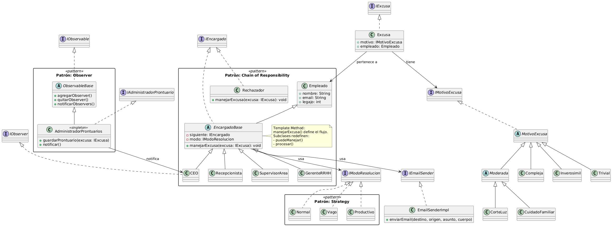

# Parcial 1 | Diseño de Sistemas

## Patrones de diseño utilizados

En el desarrollo del sistema se identificaron tres patrones de diseño principales que permiten organizar la lógica del procesamiento de excusas de manera clara, flexible y mantenible. A continuación se justifica brevemente la elección de cada uno.

### Chain of Responsibility

Se utilizó este patrón para modelar la cadena jerárquica que evalúa las excusas presentadas por los empleados. Cada encargado decide si puede resolver una excusa o si debe derivarla al siguiente nivel. Esto permite desacoplar el origen de la excusa de su resolución final.

**Participantes:**

- `Empleado`: genera la excusa.
- `Recepcionista`, `SupervisorArea`, `GerenteRRHH`, `CEO`: encargados que implementan la lógica de evaluación.
- `Rechazador`: cierra la cadena si nadie acepta la excusa.
- `EncargadoBase`: clase abstracta que contiene la lógica común de manejo.

Este diseño facilita la extensión futura del sistema, permitiendo agregar nuevos niveles jerárquicos o modificar la secuencia sin romper el resto del código.

---

### Strategy

Este patrón permite cambiar dinámicamente la forma en que un encargado procesa excusas. Se encapsulan diferentes “modos de resolución”, lo que permite alterar el comportamiento sin modificar la clase encargada.

**Participantes:**

- `IModoResolucion`: interfaz general de estrategias.
- `Normal`, `Vago`, `Productivo`: implementaciones concretas con diferentes comportamientos.

Gracias a este patrón, un mismo encargado puede actuar de distintas formas según el contexto o configuración, lo cual resulta útil para simular distintos perfiles o estilos de liderazgo.

---

### Observer

Se empleó este patrón para permitir que ciertos componentes reaccionen cuando una excusa es registrada. De esta forma, el sistema puede notificar a los observadores sin acoplar directamente el emisor con ellos.

**Participantes:**

- `IObservable`, `ObservableBase`: definen el comportamiento del sujeto observable.
- `AdministradorProntuarios`: observador central que guarda las excusas procesadas y notifica a los interesados.
- `CEO`: observador que recibe las notificaciones.

Este diseño permite que los encargados se concentren en procesar la excusa, mientras que la administración y seguimiento se maneja de forma separada y automática.

---

### Template Method

El patrón Template Method se aplicó para definir la estructura base del procesamiento de excusas, dejando que cada estrategia defina los pasos específicos que corresponden a su modo de operar.

**Participantes:**

- `EncargadoBase`: contiene el método `manejarExcusa`, que define la plantilla general del proceso.
- Cada estrategia (`Normal`, `Vago`, `Productivo`) determina los pasos personalizados dentro del método de resolución.

Esto permite mantener una lógica general para todos los encargados, a la vez que se respeta el principio de responsabilidad única para cada estrategia de resolución.

---

### Singleton

El patrón Singleton se aplicó en el `AdministradorProntuarios`, asegurando que exista una única instancia responsable de almacenar y notificar las excusas procesadas.

**Participante:**

- `AdministradorProntuarios`: clase única que centraliza el registro de excusas y la gestión de observadores.

Esta decisión garantiza consistencia en el almacenamiento de información y evita duplicación o pérdida de datos, especialmente útil en sistemas con múltiples fuentes de notificación.

---

## Diagrama de Clases

